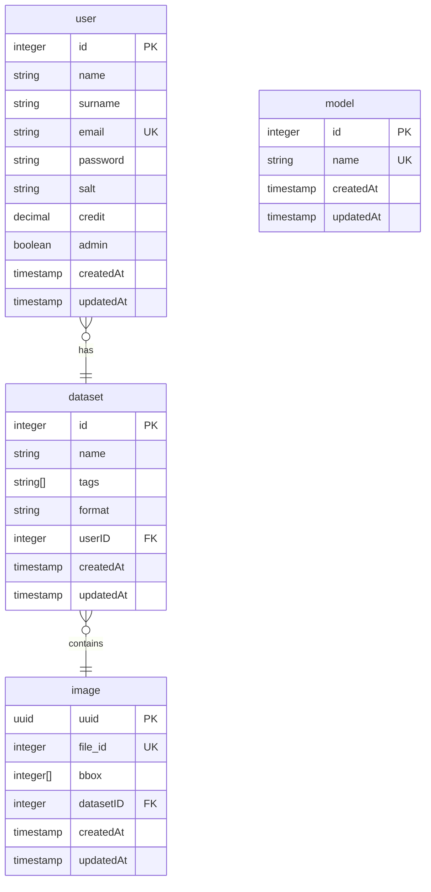
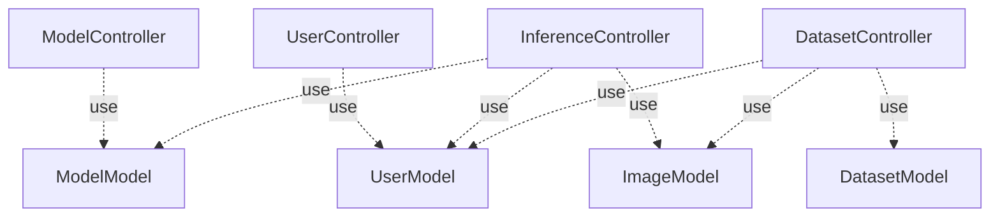
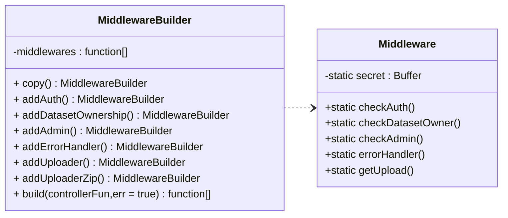
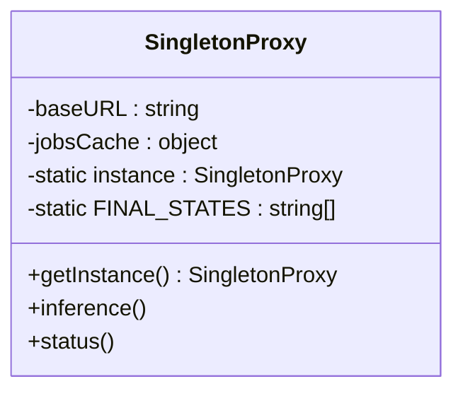
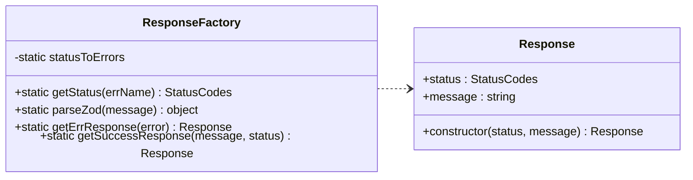
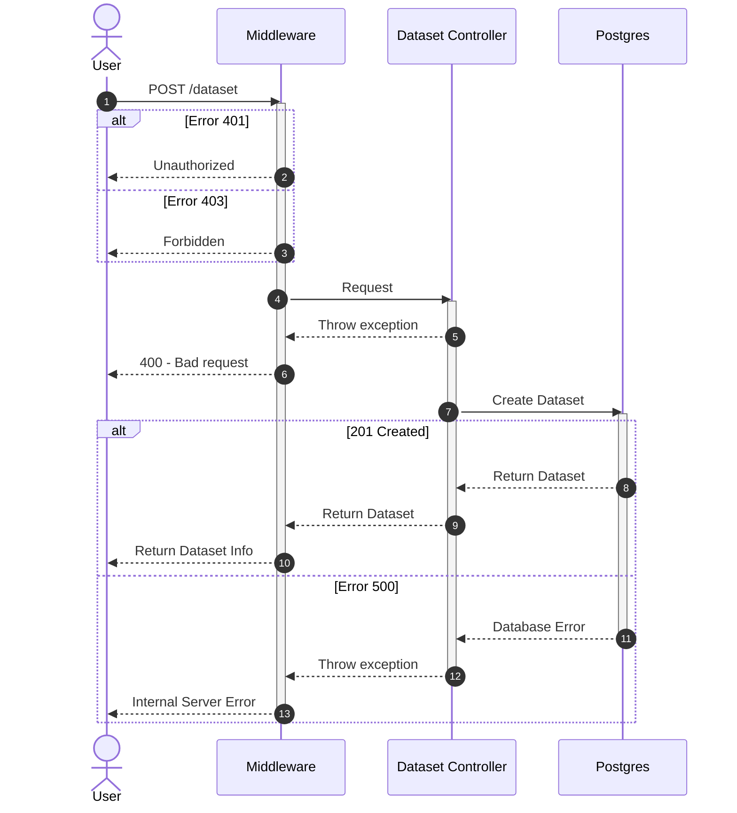
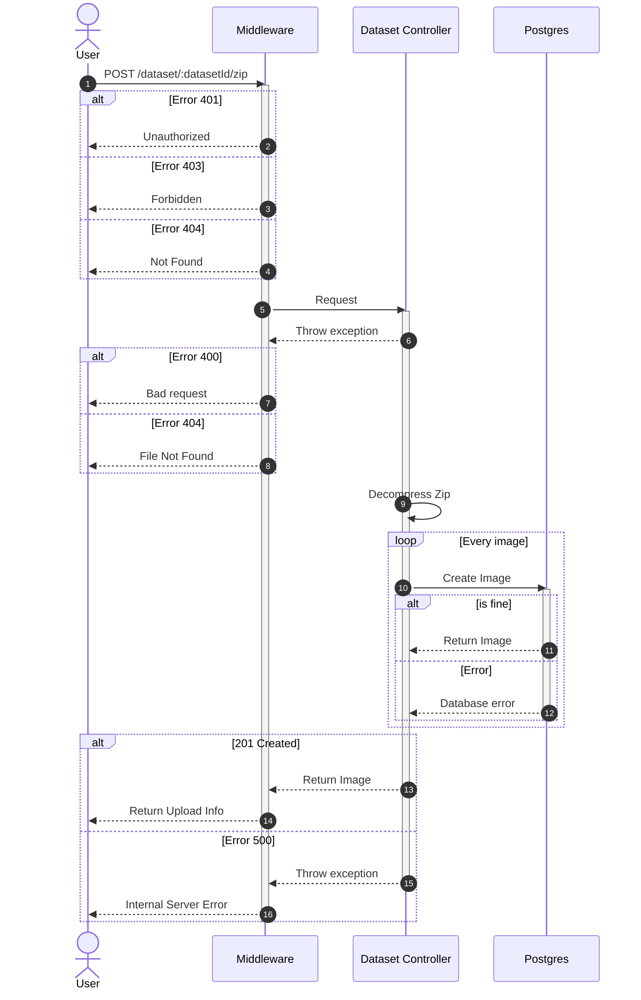
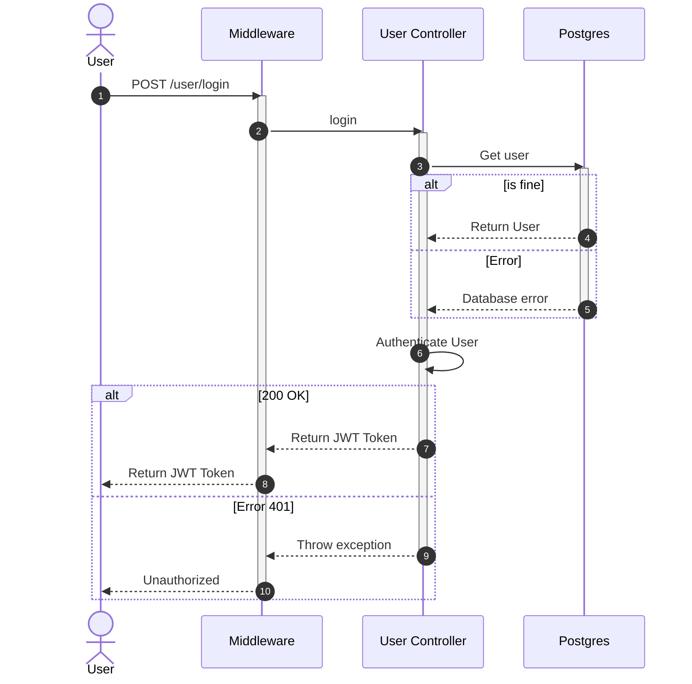

# PoseEstimator
## Obiettivo del progetto
**PoseEstimator** è una API in [Express.js](https://expressjs.com/) che permette di fare inferenza su immagini utilizzando la rete neurale [HRNet](https://github.com/Vito-Scaraggi/HRNet-Human-Pose-Estimation) per il *task* di stima della posa. Il modello è stato addestrato per la *Keypoint Detection* su immagini di profondità di bambini nati prematuri ([BabyposeDataset](https://link.springer.com/article/10.1007/s11517-022-02696-9)).

## Progettazione
### Architettura dei servizi docker 

```mermaid
  flowchart LR;
      user[user] -->|API request| server
      
      subgraph <b>docker services</b>
      
      server[backend <div> <b> node.js];
      db[(database <div> <b> postgres)];
      flask[publisher server <div> <b> python3, flask ];
      rabbitMQ[job queue <div> <b> rabbitMQ];
      worker[HRNet model <div> <b> python3, pytorch];

      server-->|store and \n retrieve data| db;
      server -->|start inference and\n get results|flask
      -->|push tasks\n and pop results|rabbitMQ    
      worker -->|receive tasks| rabbitMQ
      
      end
```
Il diagramma rappresenta i servizi docker che compongono l'applicazione e le interazioni tra di essi. I nodi corrispondono a *container docker* orchestrati con l'utilizzo di *docker compose*. 

L'utente richiama le API esposte dal *backend node.js*. L'interazione B2B (*backend to backend*) avviene tra il server in *node.js* e un server in *flask* che si occupa di inviare richieste di inferenza al modello *pytorch* di HRNet tramite il framework *celery*.
### Diagramma dei casi d'uso
Il diagramma sottostante rappresenta il diagramma dei casi d'uso, cioè delle funzionalità disponibili agli utenti.


### Schema database 




### Pattern architetturale
Il pattern architetturale scelto per il design dell'API è una variante del MVVM (*Model-View-ViewModel*), privato della componente *View* al fine realizzare un *backend* puro. L'MVVM prevede di incapsulare la *business logic* all'interno del *ViewModel*, mentre il *Model* costituisce soltanto il modello dei dati. L'applicazione implementa un *ViewModel* (*alias* Controller) per ogni funzionalità individuata in fase di progettazione e un *Model*, creato con il *framework* [Sequelize](https://sequelize.org/), per ogni tabella presente all'interno del database.



### Design pattern

#### Middleware / Builder
Il framework [Express.js](https://expressjs.com/) supporta nativamente il pattern *middleware*. Le richieste all'API vengono gestite da una serie di funzioni *middleware*, ognuna delle quali ha accesso agli oggetti *req* (Request), *res* (Response) e alla funzione *next* (NextFunction) che permette di invocare il *middleware* successivo.

Nel progetto si utilizzano il *middleware application-level* di terze parti *body-parser* e alcuni *middleware router-level custom*. Per lo sviluppo dei *middleware router-level* è stato adottato il *pattern Builder*. La classe *MiddlewareBuilder* facilita la costruzione di catene di *middleware functions* personalizzate evitando variabili *hard-coded* e codice duplicato. I metodi *"add"* aggiungono all'array *middlewares* la funzione corrispondente definita nella classe *Middleware*; il metodo *copy* effettua una *deep copy* dell'oggetto *MiddlewareBuilder* rendendolo riutilizzabile per rotte che condividono in tutto o in parte le funzioni di *middleware*. Il metodo *build* appende all'array *middlewares* la funzione del *controller* da richiamare e, se non specificato diversamente, il *middleware* per la gestione degli errori.



I *middleware* previsti sono:
- checkAuth(): effettua l'autenticazione degli utenti
- checkDatasetOwner(): controlla che l'utente sia il proprietario del *dataset* specificato
- checkAdmin(): controlla che l'utente sia *admin*
- errorHandler(): gestisce le eccezioni e invia la risposta di errore
- getUpload(): gestisce l'upload di immagini o zip

#### Proxy / Singleton

L'inferenza sulle immagini deve essere effettuata soltanto dopo la validazione dei dati della richiesta e, in generale, l'accesso al modello HRNet, essendo una risorsa condivisa e computazionalmente onerosa, dev'essere controllato. Per questi motivi si è scelto di utilizzare il pattern *Proxy* per effettuare le chiamate alle API flask. Il metodo *inference()* esegue una chiamata POST al server flask per avviare l'inferenza soltanto se il *dataset* non è vuoto. 

Il *proxy* effettua anche il *caching* dei risultati dei *job*: infatti il metodo *status()* esegue una chiamata GET al server *flask* per conoscere lo stato di un *job* soltanto se non è presente nella *jobsCache* con assegnato uno degli stati finali.

Inoltre l'istanza dell'oggetto *proxy* è *singleton*.



#### Factory
La gestione degli errori è completamente demandata al *middleware errorHandler()* che, in base all'eccezione catturata, si occupa di rispondere con lo *status code* e il messaggio corretti. Per mappare le eccezioni al tipo di risposta è stato impiegato il *pattern Factory*. 

*Response Factory* crea oggetti di classe *Response* attraverso i metodi *getErrResponse()*, nel caso di errori, e *getSuccessResponse()* nel caso di successo. In particolare *getErrResponse()* restituisce un oggetto *Response* *custom* in base al nome della classe dell'eccezione lanciata, richiamando il metodo *getStatus()* che effettua una ricerca sul dizionario *statusToErrors*; *parseZod()* è un metodo di utilità che converte i messaggi delle eccezioni *ZodError* in validazione.


#### Altri pattern
Nell'implementazione sono stati utilizzati anche il pattern *DAO*, reso disponibile dal *framework* Sequelize, e il pattern *wrapper* per incapsulare il codice *pytorch* necessario per l'inferenza all'interno di una funzione *python* che ne "decora" il comportamento.

### Diagrammi UML

Sequence diagram per la creazione di un dataset


Sequence diagram per l'inserimento di un file zip in un dataset


Sequence diagram per il login di un utente


## API

###Get all Datasets
Route:
```
GET /dataset/all
```
Authorization:
```
token
```
Response:
```

```

****
Route:
```
GET /dataset/all
```
Authorization:
```

```
Response:
```

```
## Quick start
Per utilizzare l'applicazione segui i seguenti step:

1. Installa *docker* e *docker compose*
2. Clona il repository
3. Scarica da [Model download](https://mega.nz/file/RmhF1KrK#_UfUSyS0S9oWF6dQnQUetbREhEad5JGIR3e3CVF5lnI) il modello con estensione .pth e posizionalo nella cartella di progetto nel modo seguente:

```
.
├── HRNet-Human-Pose-Estimation
│   ├── models
│   │   └── multi_out_pose_hrnet.pth
│   ├── ...
├── LICENSE
├── README.md
├── docker-compose.yml
├── publisher
└── server

```

4. Nella *root* di progetto esegui da terminale il comando:
```
  docker compose up
```

> **Tip**:bulb:: Scarica da [Dataset download](https://mega.nz/file/Ii4AhTIA#Vl6hkcguHW2ZAvgotDtCdrZYt30ZROkjn6LciSdpDY8) alcune immagini di test con annotazione appartenenti al [BabyposeDataset](https://link.springer.com/article/10.1007/s11517-022-02696-9). Puoi utilizzarle per effettuare l'inferenza inserendo opzionalmente il bounding box annotato.

## Testing

### Development stack

[](https://skillicons.dev)

### Contributors

[Vito Scaraggi](https://github.com/Vito-Scaraggi) & [Luca Guidi](https://github.com/LucaGuidi5)
