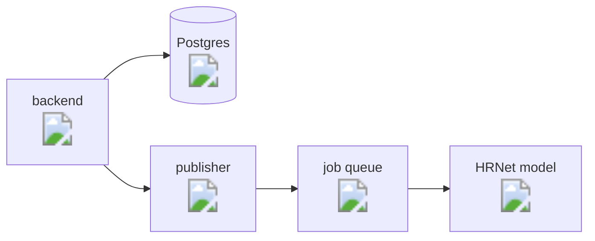
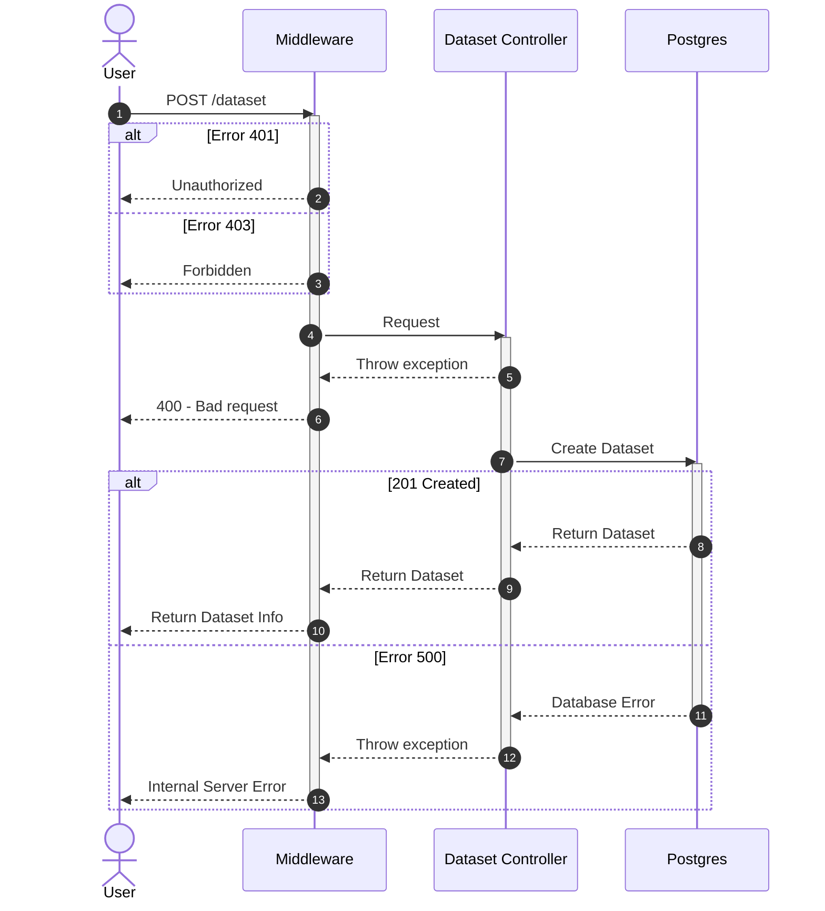
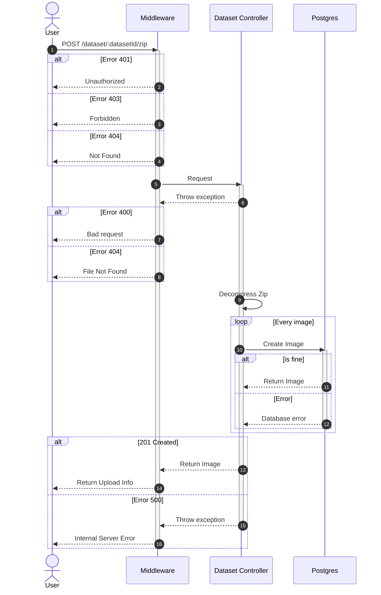
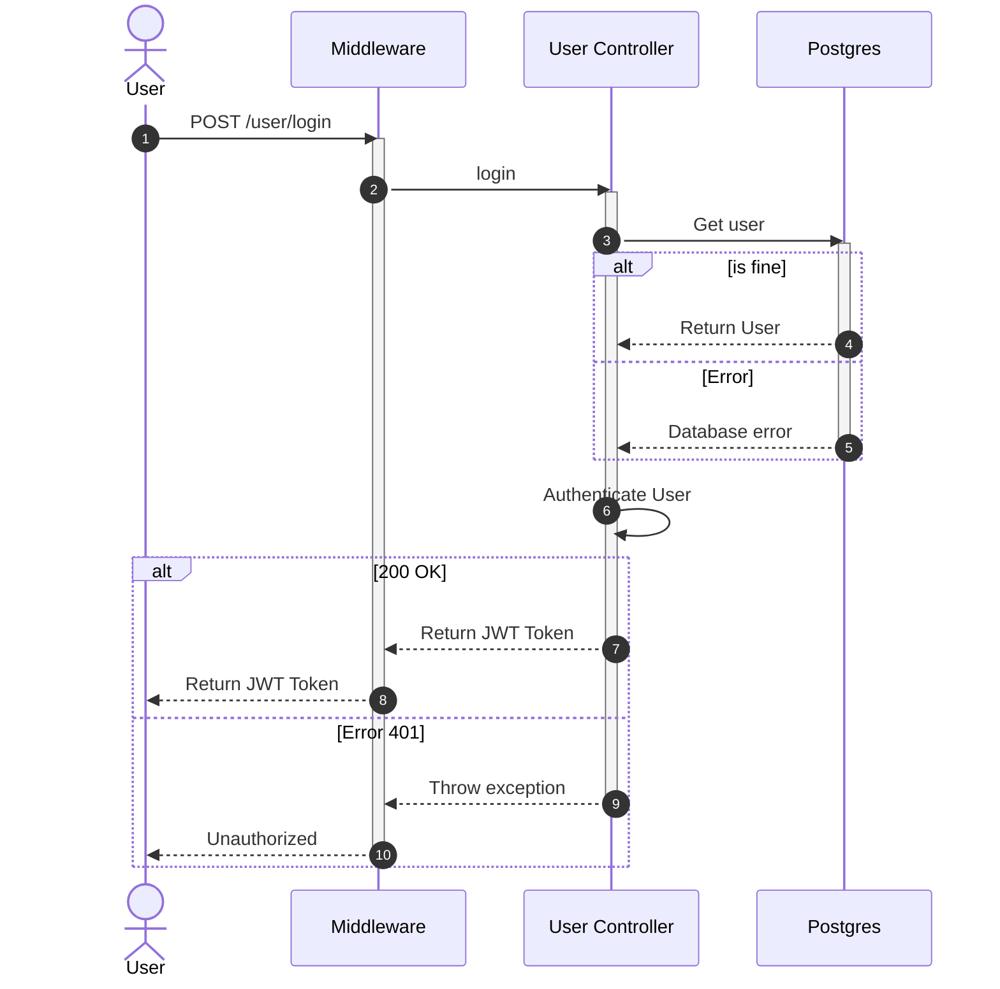

# PoseEstimator
**PoseEstimator** è un back-end in [Node.js](https://nodejs.org/en) che permette di fare inferenza su immagini utilizzando la rete neurale [HRNet](https://github.com/Vito-Scaraggi/HRNet-Human-Pose-Estimation) per il *task* di stima della posa.

## Obiettivo del progetto
## Progettazione
### Architettura dei servizi docker


### Pattern
### Diagrammi UML

Sequence diagram per la creazione di un dataset


Sequence diagram per l'inserimento di un file zip in un dataset


Sequence diagram per il login di un utente


## API
## Quick start
Per utilizzare l'applicazione segui i seguenti step:

1. Installa *docker* e *docker compose*
2. Clona il repository
3. Scarica da [Model download](https://mega.nz/file/RmhF1KrK#_UfUSyS0S9oWF6dQnQUetbREhEad5JGIR3e3CVF5lnI) il modello con estensione .pth e posizionalo nella cartella di progetto nel modo seguente:

```
.
├── HRNet-Human-Pose-Estimation
│   ├── models
│   │   └── multi_out_pose_hrnet.pth
│   ├── ...
├── LICENSE
├── README.md
├── docker-compose.yml
├── publisher
└── server

```

4. Nella *root* di progetto esegui da terminale:
```
  docker compose up
```

> **Tip**:bulb:: Scarica da [Dataset download](https://mega.nz/file/Ii4AhTIA#Vl6hkcguHW2ZAvgotDtCdrZYt30ZROkjn6LciSdpDY8) alcune immagini di test con annotazione appartenenti al [BabyposeDataset](https://link.springer.com/article/10.1007/s11517-022-02696-9). Puoi utilizzarle per effettuare l'inferenza inserendo opzionalmente il bounding box annotato.

## Testing

#### Contributors

[Vito Scaraggi](https://github.com/Vito-Scaraggi) & [Luca Guidi](https://github.com/LucaGuidi5)